Data visualisation with ggplot2
================
Megan Stodel
20 May 2020

In this session, we’ll be learning about `ggplot2`, the most widely used
graphics package for R. Start by loading the package.

We’ll use a dataset from [this great
selection](https://vincentarelbundock.github.io/Rdatasets/datasets.html);
it’s the results of measurements of hawks.

``` r
library(ggplot2)
library(data.table)

hawks <- fread('https://vincentarelbundock.github.io/Rdatasets/csv/Stat2Data/Hawks.csv', 
               select = c('Species', 'Age', 'Sex', 'Wing', 'Weight', 'Tail', 'Year'))

# Remove some rows with missing weight or wing data
hawks <- hawks[!is.na(Weight) & !is.na(Wing)]

# Label unknown values for sex and age
hawks[Sex == "", Sex := "Unknown"]
hawks[Age == "", Age := "Unknown"]

# Label hawk species
hawks[Species == "RT", Species := "Ring-tailed"]
hawks[Species == "SS", Species := "Sharp-shinned"]
hawks[Species == "CH", Species := "Cooper's"]

# Show the first 5 rows of the dataset
hawks[1:5]
```

    ##          Species Age     Sex Wing Weight Tail Year
    ## 1:   Ring-tailed   I Unknown  385    920  219 1992
    ## 2:   Ring-tailed   I Unknown  376    930  221 1992
    ## 3:   Ring-tailed   I Unknown  381    990  235 1992
    ## 4:      Cooper's   I       F  265    470  220 1992
    ## 5: Sharp-shinned   I       F  205    170  157 1992

## Creating a basic scatterplot

The below code produces a scatterplot of the wing and tail measurements.
There are a few things to note.

  - All plots produced with `ggplot2` use the function `ggplot()` to
    start with.

  - Additional layers are added or edited with new lines of code that
    are added using the `+` symbol.

  - For the most basic graph, you will need to provide the dataset in
    the `data` argument, the features you want plotted (at least for the
    x axis, and sometimes for the y depending on the type of graph) in
    the `mapping` argument wrapped in `aes()`, and the graph type as an
    additional line as a `geom_*()` function.

<!-- end list -->

``` r
ggplot(data = hawks, mapping = aes(x = Wing, y = Tail)) + 
  geom_point()
```

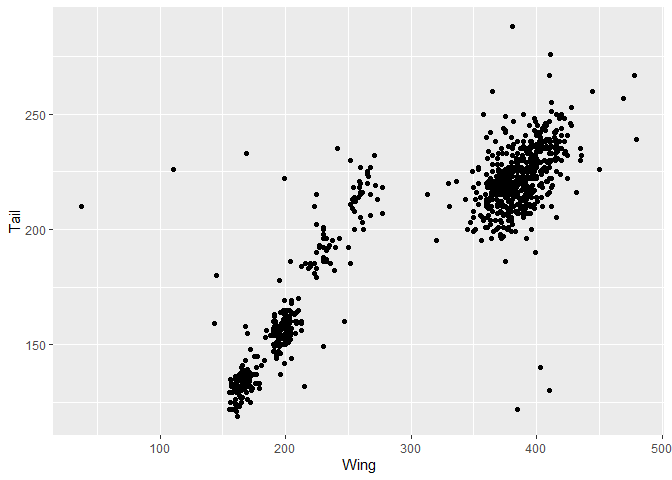<!-- -->

This is already useful for understanding the data. There is obviously a
correlation between wing and tail measurements, but there also seem to
be some clusters here.

Notice that you can get the same result putting the `aes()` in the
`geom_*()` function. The first way maps the aesthetics across every
`geom_*()` layer, whereas this version makes the mapping specific to the
layer where it is defined. In many cases, this results in the same plot,
so you will see both used in other people’s code.

``` r
ggplot(data = hawks) + 
  geom_point(aes(x = Wing, y = Tail))
```

<!-- -->

-----

**Easy mistake to make alert\!:** Make sure all your lines of ggplot
code are connected by a `+`. The pipe operator `%>%` used elsewhere in
the tidyverse won’t work here. Also watch out for missing them off
altogether, or using them at the start of lines rather than the end. If
only part of your graph seems to be plotting, check your code is all
connected properly.

-----

## Exploring more features

Here are some ways to adapt a scatterplot to show more information by
including more features to map to aesthetics.

### Colour

Colour in this example shows the hawk species.

``` r
ggplot(data = hawks) + 
  geom_point(aes(x = Wing, y = Tail, colour = Species))
```

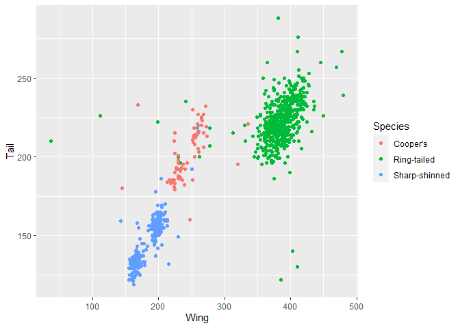<!-- -->

This allows us to see that the clusters in the data are likely due to
the different species included, with the ring-tailed species generally
on the bigger side of hawks.

Note that for aesthetics, you can also use boolean (logical)
expressions. Here the colour shows if the hawk is over 1kg.

``` r
ggplot(data = hawks) + 
  geom_point(aes(x = Wing, y = Tail, colour = Weight >= 1000))
```

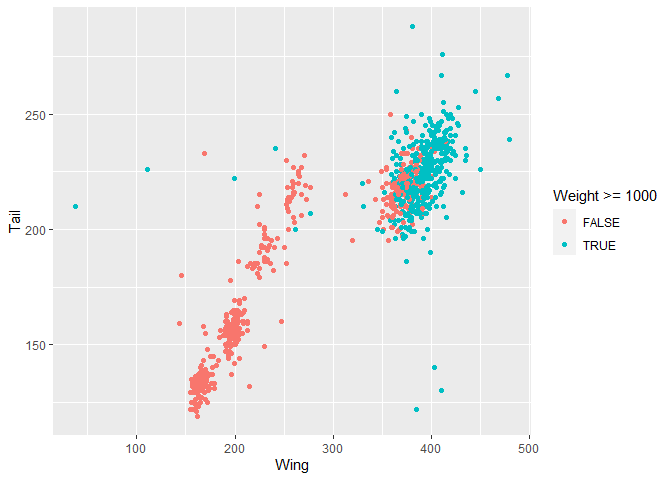<!-- -->

If you want to use colour on your graph without associating it with a
feature, set the colour outside of the `aes()` function.

``` r
ggplot(data = hawks) + 
  geom_point(aes(x = Wing, y = Tail), colour = "orange")
```

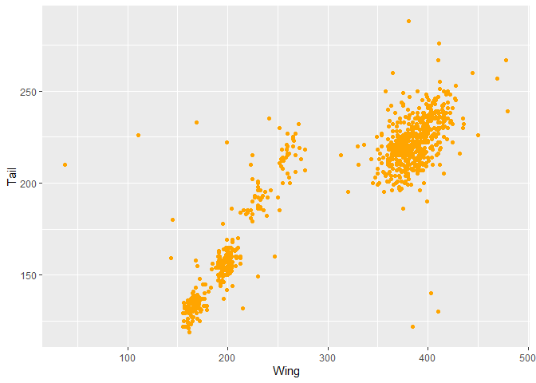<!-- -->

-----

**Easy mistake to make alert\!:** If colour isn’t working how you think
it should, double check you are calling the argument in the right place
- inside `aes()` relating to features if you want it to differ by
category or number, or outside if you are changing the colour of all
data points.

-----

### Shape

Here, the species is mapped to shape.

``` r
ggplot(data = hawks) + 
  geom_point(aes(x = Wing, y = Tail, shape = Species))
```

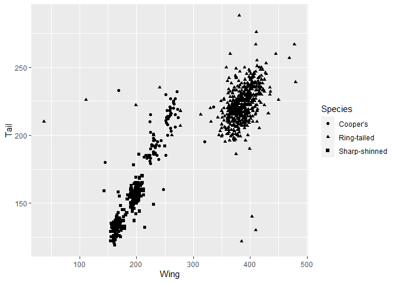<!-- -->

### Size

If you’re trying to add in a continuous variable, you could try mapping
to size - this shows weight mapped to point size, which doesn’t look
amazing but gives you the gist.

``` r
ggplot(data = hawks) + 
  geom_point(aes(x = Wing, y = Tail, size = Weight))
```

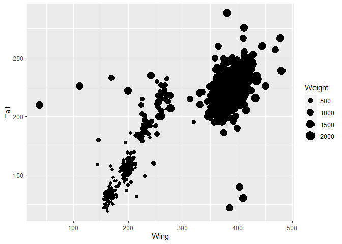<!-- -->

### Transparency

Here’s the same plot except with weight mapped to transparency.

``` r
ggplot(data = hawks) + 
  geom_point(aes(x = Wing, y = Tail, alpha = Weight))
```

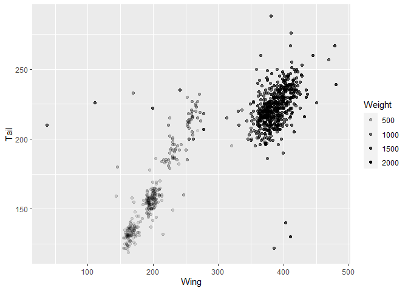<!-- -->

### Alternative ways of exploring by feature

You can also use the `facet_wrap()` function to break a categorical
variable into separate graphs. This might help pick out specific
categories worth exploring further.

``` r
ggplot(data = hawks) + 
  geom_point(aes(x = Wing, y = Tail, colour = Species)) +
  facet_wrap(~ Sex, nrow = 2)
```

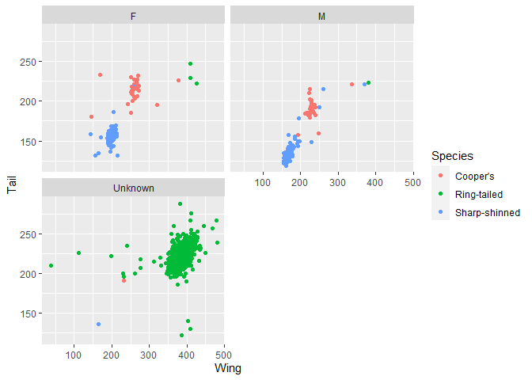<!-- -->

Here, for example, picking out sex produces three graphs, including one
where sex is unknown. Interestingly these correspond to one of the
species clusters, which might lead to some questions about the data. Is
that hawk species harder to sex? Or was the data collected differently
in different studies?

## Exploring more geoms

So far all the examples have used scatterplots, but ggplot2 supports a
large number of plot types. Below are just a handful more examples.
Although the principles are the same, sometimes the arguments required
are different depending on what is needed for the plot to make sense.

### Bar charts

Use `geom_bar()` for a bar chart. This one shows the number of hawks in
each species

``` r
ggplot(data = hawks, mapping = aes(x = Species, fill = Species)) + 
  geom_bar()
```

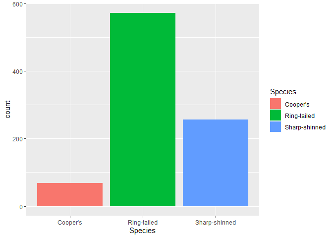<!-- -->

Use position adjustments to change the visuals. Here are some options if
you want to look at Age (I = Infant and A = Adult) and Sex. You could
use a stacked bar chart based on totals or proportions, or dodge the
bars.

``` r
ggplot(data = hawks, mapping = aes(x = Age, fill = Sex)) + 
  geom_bar()
```

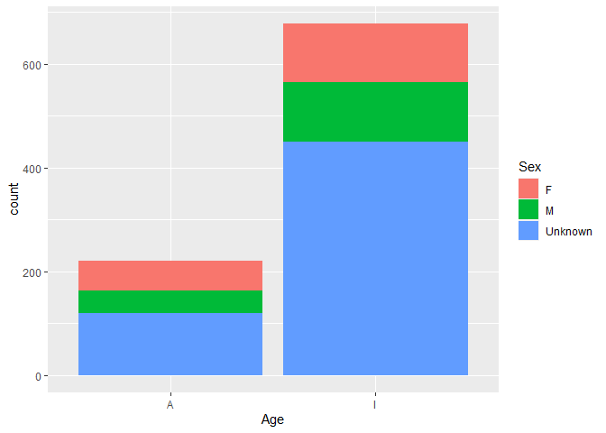<!-- -->

``` r
ggplot(data = hawks, mapping = aes(x = Age, fill = Sex)) + 
  geom_bar(position = "fill")
```

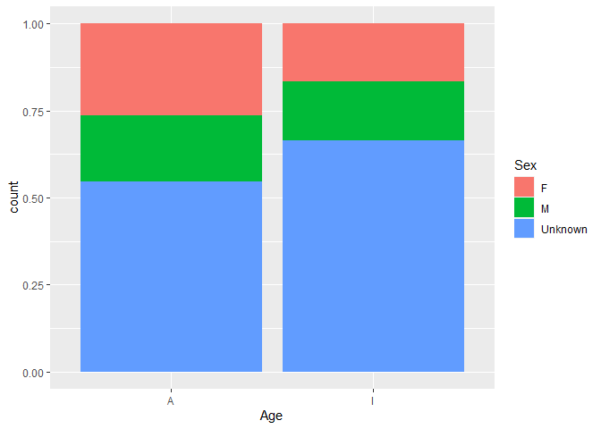<!-- -->

``` r
ggplot(data = hawks, mapping = aes(x = Age, fill = Sex)) + 
  geom_bar(position = "dodge")
```

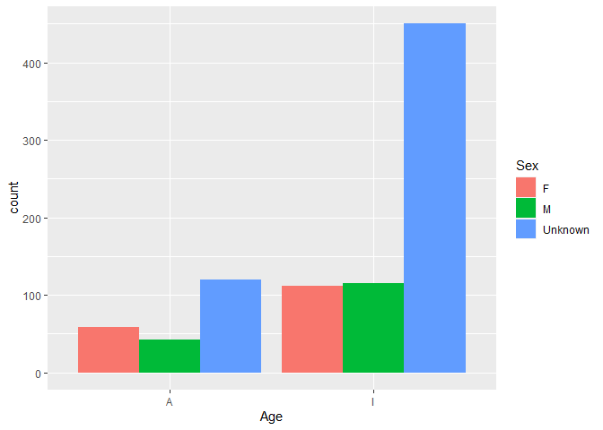<!-- -->

### Boxplots

Use `geom_boxplot()` for a boxplot; here are some showing tail
measurements by Sex.

``` r
ggplot(data = hawks, mapping = aes(x = Sex, y = Tail)) +
  geom_boxplot()
```

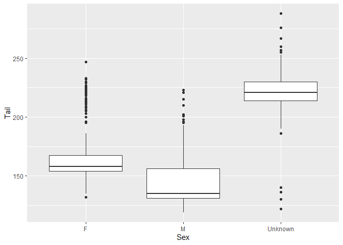<!-- -->

### Histograms

And using `geom_histogram()` you can create a histogram - change the
`bins` argument if you want. This one shows the data by Wing size.

``` r
ggplot(data = hawks, mapping = aes(x = Wing)) +
  geom_histogram(bins = 15)
```

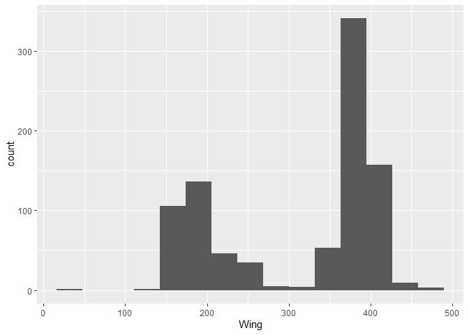<!-- -->

### Multiple plot types

You can layer different geom types in one plot by just adding them into
the code chunk. The below is a nightmare chart that I would not suggest
you actually do, but I couldn’t think of a great example with this
dataset\! The key thing to note is that I have included both
`geom_point()` and `geom_line()`.

``` r
ggplot(data = hawks, aes(x = Tail, y = Wing)) + 
  geom_point() +
  geom_line()
```

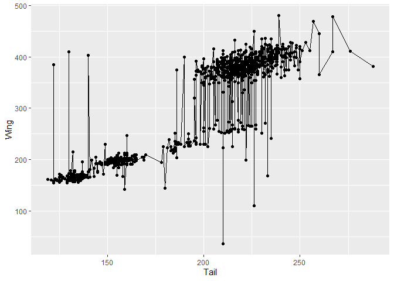<!-- -->

## Adjusting a plot

Choosing the right chart type and getting the data mapped is critical,
but you also want something aesthetically acceptable. Here is a bar
chart of number of hawks in each species, with age shown.

``` r
ggplot(data = hawks, mapping = aes(x = Species, fill = Age)) + 
  geom_bar()
```

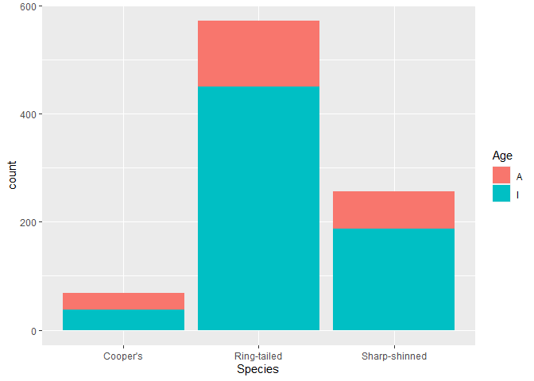<!-- -->

  - Hard to understand labels

  - Unhelpful order

  - Not particularly attractive

Here is when we start layering up our ggplots, with a lot of options for
adapting them how we want.

### Labels

Starting with the `labs()` function, we can change a lot of the text.

``` r
ggplot(data = hawks, mapping = aes(x = Species, fill = Age)) + 
  geom_bar() +
  labs(y = "Count", title = "Number of hawks by species") + 
  scale_fill_discrete(labels = c("Adult", "Infant"))
```

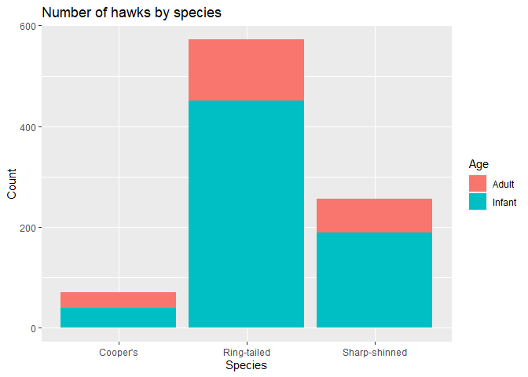<!-- -->

Here we’re capitalising the first letter of the labels on the y axis and
adding a title, as well as changing the legend to be a bit clearer. Of
course, you could also change the labels in your dataset, but if you’ve
already set up a workflow using the original labels, you might be
reluctant to change them everywhere just for the sake of the graph.

For any line you use in the creation of a ggplot object, you can run the
code in one block as we have been doing throughout or add to an existing
ggplot object as
below.

``` r
hawks_plot <- ggplot(data = hawks, mapping = aes(x = Species, fill = Age)) + 
  geom_bar()

hawks_plot +
  labs(y = "Count", title = "Number of hawks by species") + 
  scale_fill_discrete(labels = c("Adult", "Infant"))
```

<!-- -->

### Reordering

This would be easier to interpret if the species were ordered by count.

This is a quick and easy way using the forcats package, which doesn’t
change your original data. The alternative is to transform your original
data so your variable is a factor ordered by count, which is a bit
cumbersome if the only reason you are doing it is for one plot. Note
that the change comes in defining the x argument in `aes()`.

Note that we also have to add in a label for the x axis; otherwise we
would get the unsightly `forcats::fct_infreq(Species)` as the label.
Bear in mind that if you have the `forcats` packaged loaded, you don’t
need to specific the package in the function call, which makes it look a
little less
busy.

``` r
ggplot(data = hawks, mapping = aes(x = forcats::fct_infreq(Species), fill = Age)) + 
  geom_bar() +
  labs(x = "Species", y = "Count", title = "Number of hawks by species") + 
  scale_fill_discrete(labels = c("Adult", "Infant"))
```

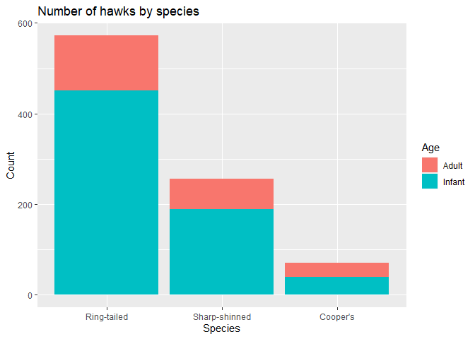<!-- -->

### Change the theme

There are several themes built into ggplot2, so you can easily use one
of those to quickly achieve a look you are happy with. These impact the
colour of the plot, thickness and existence of gridlines, font details,
legend position and more. Below are a few
examples.

``` r
ggplot(data = hawks, mapping = aes(x = forcats::fct_infreq(Species), fill = Age)) + 
  geom_bar() +
  labs(x = "Species", y = "Count", title = "Number of hawks by species") + 
  scale_fill_discrete(labels = c("Adult", "Infant")) + 
  theme_bw()
```

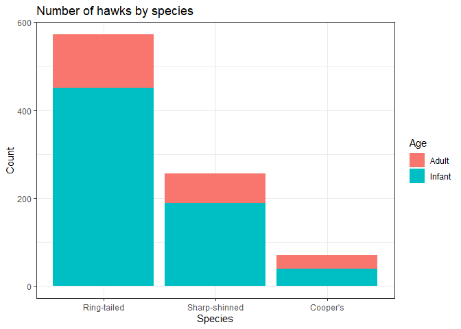<!-- -->

``` r
ggplot(data = hawks, mapping = aes(x = forcats::fct_infreq(Species), fill = Age)) + 
  geom_bar() +
  labs(x = "Species", y = "Count", title = "Number of hawks by species") + 
  scale_fill_discrete(labels = c("Adult", "Infant")) + 
  theme_classic()
```

<!-- -->

``` r
ggplot(data = hawks, mapping = aes(x = forcats::fct_infreq(Species), fill = Age)) + 
  geom_bar() +
  labs(x = "Species", y = "Count", title = "Number of hawks by species") + 
  scale_fill_discrete(labels = c("Adult", "Infant")) + 
  theme_minimal()
```

<!-- -->

You can also create your own theme using `theme()` and assigning it as
an object.

This one changes the background and plot background colour, sets the
line width and type and removes minor gridlines and x axis gridlines

``` r
my_theme <- theme(
  plot.background = element_rect(fill = "#F2E8CF"),
  legend.background = element_rect(fill = "#F2E8CF"),
  panel.background = element_rect(fill = "#F2E8CF",
                                  size = 0.5, 
                                  linetype = "solid"),
  text = element_text(colour = "#4A4238"),
  panel.grid.major.y = element_line(colour = "#4A4238", 
                                  size = 0.2, 
                                  linetype = "dotted"),
  panel.grid.major.x = element_blank(),
  panel.grid.minor = element_blank()
)
ggplot(data = hawks, mapping = aes(x = forcats::fct_infreq(Species), fill = Age)) + 
  geom_bar() +
  labs(x = "Species", y = "Count", title = "Number of hawks by species") + 
  scale_fill_discrete(labels = c("Adult", "Infant")) + 
  my_theme
```

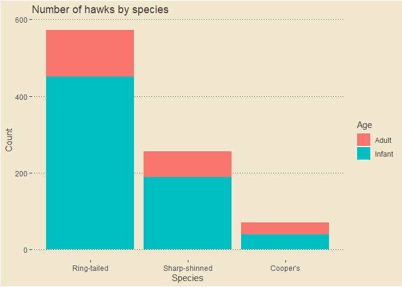<!-- -->

Finally, here’s a trick to change the colour palette, which affects the
colours of the bars. You can’t do this within `theme()`, but as [this
StackOverflow answer](https://stackoverflow.com/a/36477374)
demonstrates, you can bundle this element into a list with what you
already have. Unfortunately, as you can’t have multiple scales for each
aesthetic, I’ve had to rename the ages in the dataset rather than
labelling them differently here.

``` r
my_colors <- c("#386641", "#A7C957")
my_theme_2 <- list(my_theme, scale_fill_manual(values = my_colors))

hawks[Age == "A", Age := "Adult"]
hawks[Age == "I", Age := "Infant"]

ggplot(data = hawks, mapping = aes(x = forcats::fct_infreq(Species), fill = Age)) + 
  geom_bar() +
  labs(x = "Species", y = "Count", title = "Number of hawks by species") + 
  my_theme_2
```

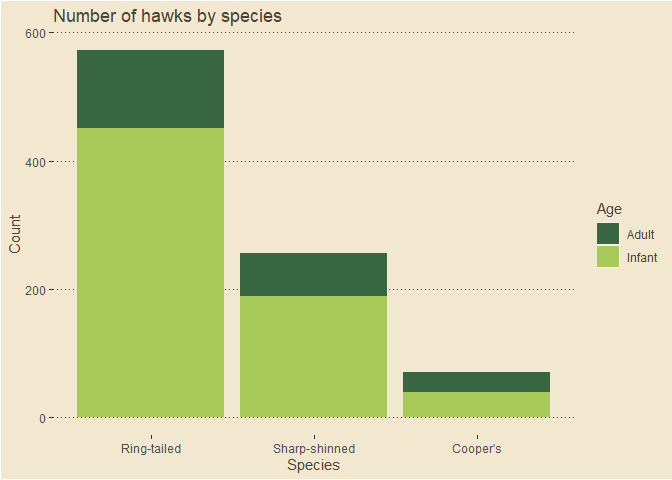<!-- -->

Here is the original plot for comparison.

``` r
ggplot(data = hawks, mapping = aes(x = Species, fill = Age)) + 
  geom_bar()
```

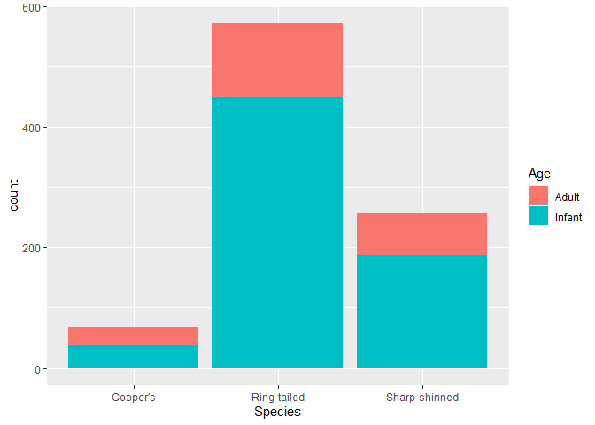<!-- -->

You can use your new theme on other plots.

``` r
ggplot(data = hawks, mapping = aes(x = Age, y = Weight, fill = Age)) +
  geom_boxplot() +
  my_theme_2
```

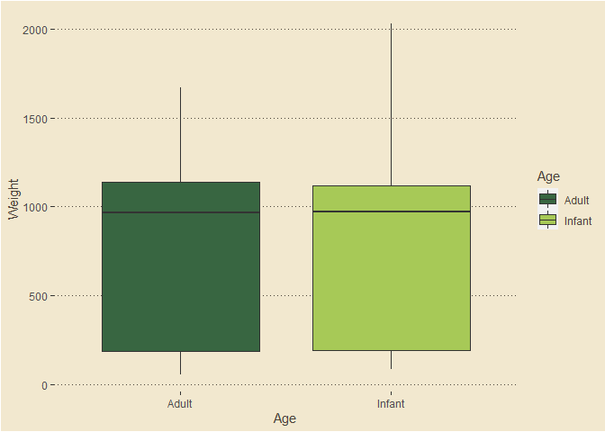<!-- -->

## Over to you

In the next 10 minutes, create your own graph using ggplot2 and the
hawks dataset. It would be great to see some examples so be ready to
share your screen or your code for me to run at the end of the session\!

I’d suggest starting from scratch and using features and chart types
that interest you, but if you want to focus on adapting the theme and
are running out of time, feel free to adapt the following basic code.

``` r
ggplot(data = hawks, mapping = aes(x = Year, fill = Species)) + 
  geom_bar()
```

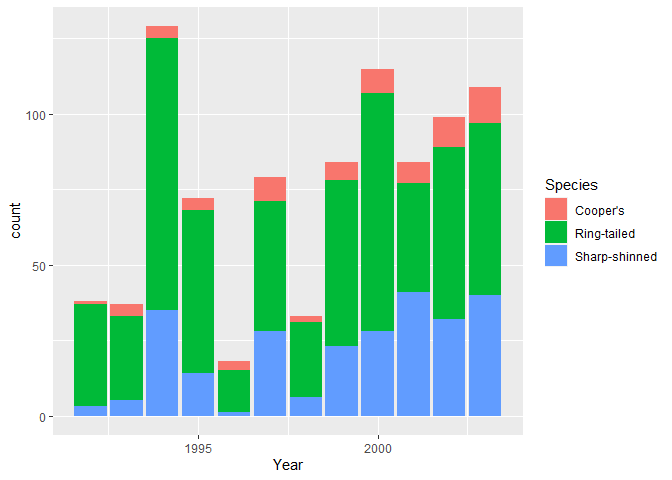<!-- -->

## Other resources

  - [Data visualisation chapter of R For Data
    Science](https://r4ds.had.co.nz/data-visualisation.html)

  - [Another good ggplot2
    tutorial](http://r-statistics.co/Complete-Ggplot2-Tutorial-Part1-With-R-Code.html)

  - [Named colours in
    R](http://www.stat.columbia.edu/~tzheng/files/Rcolor.pdf)

  - [Colour palettes in
    R](https://github.com/EmilHvitfeldt/r-color-palettes)

  - [bbplot package](https://github.com/bbc/bbplot) - BBC theme for
    ggplot2
